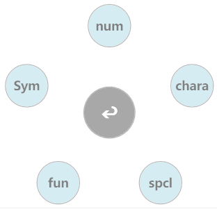
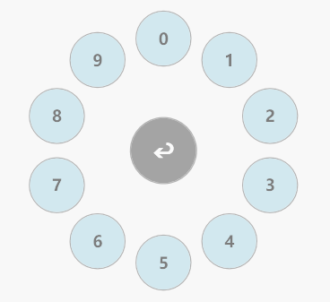
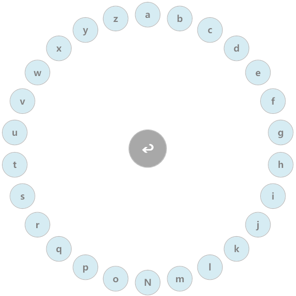
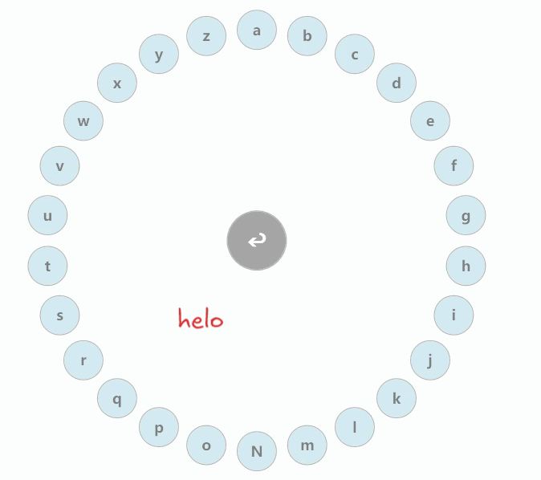
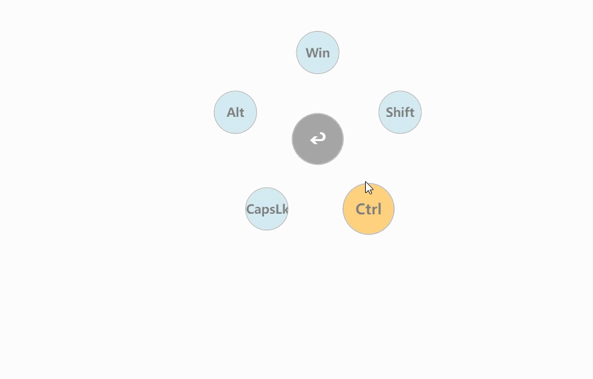

# Tovch

一款结合kando设计理念的鼠标输入软件

本项目使用C sharp作为编程语言，使用WPF开发桌面应用架构。

项目结构如图
	

```test
/NodeTreeConfig.cs    //项目节点树的配置文件
/MenuItemNode.cs      //项目节点的Class类文件
/NodeTree.cs		  //节点树的Class文件
/AnimationConfig.cs   //动画配置文件
/NodeConfig.cs		  //节点配置文件
/TextInjection.cs     //文本注入实现文件
/MainWindow.xaml      //渲染进程文件
/MainWindow.xaml.cs   //主进程文件
/NodeController.cs    //节点方法配置文件
/LabelConfig.cs       //隐藏标签配置文件
/InteractionConfig.cs //交互配置文件<快捷键配置文件>
/MenuActivation.cs    //快捷键注册文件

AnimationConfig.cs		 //动画配置文件
App.xaml.cs				 //项目程序入口
DragController.cs 		 //拖拽事件控制文件
InteractionConfig.cs 	 //拖拽节点进入节点的控制文件
LabelConfig.cs			 //标签的控制信息
MainWindow.xaml.cs		 //窗口映射文件
MenuActivation.cs 		 //窗口行为文件
MenuItemNode.cs			 //窗口中的节点配置类
ModifierKeyConfig.cs	 //修饰按键配置文件
ModifierKeyState.cs		 //修饰按键状态文件
NodeActionHandlers.cs	 //节点行为管理文件
NodeConfig.cs			 //节点配置类
NodeController.cs		 //节点控制类
NodeEventBinder.cs		 //节点行为监听类
NodeEventTriggers.cs	 //节点事件绑定文件
NodeTree.cs				 //节点树类
NodeTreeConfig.cs		 //节点树配置文件
TextInjection.cs		 //文本注入实现逻辑
```

项目结构清晰，主要的节点树的构成在Mainwindow.cs下的Window_Load方法下。

## 默认配置快捷键

项目启动后的默认唤醒快捷键是：ctrl + shift + F12   测试的时候防止快捷键冲突设置的冷门快捷键。
项目隐藏快捷键为:ESC

切换标签快捷键是：ctrl + T


## 项目操作指南

双击项目文件可以打开项目，这时候项目会静默在后台。

当用户敲击启动快捷键[默认配置是ctrl + shift + F12]后项目被前台唤起：



这时候可以看到给键位分成了五大类型：

num   :  仅存放1-9；



chara ：存放 a - z:



这些按键由于相对普通不涉及任何特殊功能，为了输出快捷:可以使用拖拽进行组合输出，将节点A拖拽时经过别的节点B时，可以组合文本注入AB。

同时也可以实现跨级拖拽来实现手势输入操作。



切换到sym可以对修饰按键以及快捷键的集成使用：

例如：


